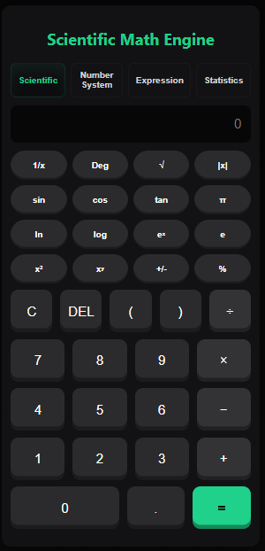
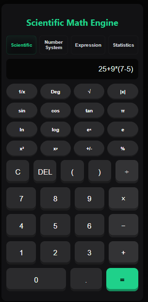
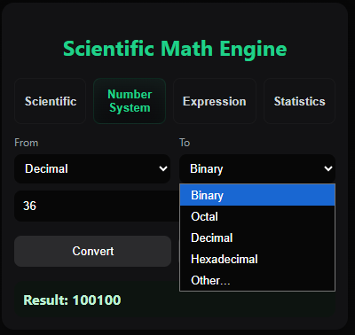
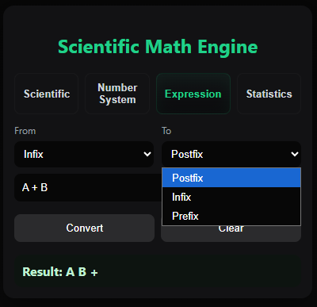
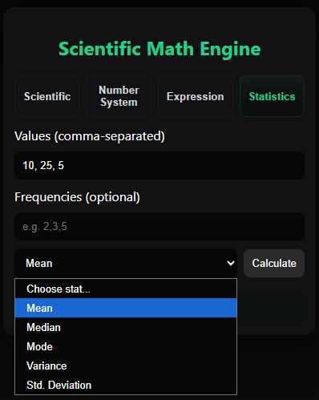

# 🧮 Scientific Math Engine

A powerful **multi-mode scientific calculator** built using **HTML, CSS, and JavaScript**.  
This project combines multiple mathematical tools into one clean and interactive interface.

---

## 🚀 Features

### 🔬 Scientific Calculator
- Basic arithmetic operations (+, −, ×, ÷)
- Trigonometric functions: `sin`, `cos`, `tan`
- Logarithmic functions: `log`, `ln`
- Constants: `π`, `e`
- Power operations (`x²`, `xʸ`)
- Square root, reciprocal, absolute value
- Percentage calculation
- Degree / Radian toggle

---

### 🔢 Number System Converter
- Convert between:
  - Binary (Base 2)
  - Octal (Base 8)
  - Decimal (Base 10)
  - Hexadecimal (Base 16)
- Custom base support (Base 2–32)
- Swap bases instantly

---

### 🔄 Expression Converter
Supports conversion between:
- Infix
- Postfix
- Prefix

✨ Includes:
- Stack-based algorithm implementation
- Operator precedence handling

---

### 📊 Statistics Calculator
- Mean
- Median
- Mode
- Variance
- Standard Deviation
- Supports frequency input

---

## 🛠️ Tech Stack

- HTML5
- CSS3
- JavaScript (Vanilla JS)

---

## 📂 Project Structure
scientific-math-engine/ 
│── assets/ 
│ ├── expression.png 
│ ├── number.png 
│ ├── scientific.png 
│ ├── screenshot.png 
│ └── stats.png 
│── .gitignore 
│── README.md 
│── index.html 
│── script.js 
└── style.css 

---

## ▶️ How to Run

1. Clone the repository:
   git clone https://github.com/panchajanya-ray/scientific-math-engine.git

2. Open the project folder

3. Run:
- Open `index.html` in your browser

---

## 📸 Screenshots

### Main Interface

### Scientific Mode

### Number System Converter

### Expression Converter

### Statistics Mode

---

## 🎯 Future Improvements

- 📈 Graph plotting (visual charts)
- 🧾 Calculation history
- 🌗 Dark / Light theme toggle
- 🔐 Replace `eval()` with safer parser (e.g. math.js)
- 📱 Mobile app version (React / Flutter)

---

## 💡 Key Highlights

- Clean and modular code structure
- Multiple mathematical utilities in one app
- Strong use of JavaScript logic and algorithms
- User-friendly UI design

---
## 👨‍💻 Author

PANCHAJANYA RAY 
MCA Student | Web Developer 
https://github.com/panchajanya-ray

---

## ⭐ Support

If you like this project:
- ⭐ Star this repository
- 🍴 Fork it
- 🛠️ Contribute improvements

---

## 📄 License

This project is open-source and free to use.
